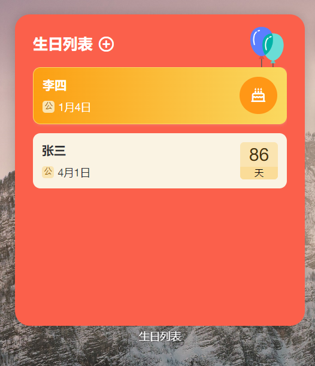
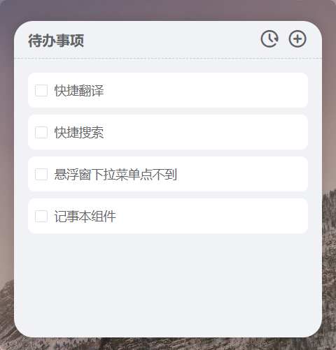

<p align="center">
<a href="https://github.com/widget-js/widgets">
  
</a>
<br>
桌面组件
</p>

<p align="center">
  
  <a href="https://discord.gg/vwSAaRR8cT"></a>
</p>


### 说明
这是桌面组件前端开源组件，项目还在持续完善中

### Windows 10/11 客户端下载
https://www.microsoft.com/store/productId/9NPR50GQ7T53

### 项目目录结构

```
widgets
├── src
│   ├── components                // 常用Vue组件
│   ├── views                     //
│   ├── widgets                   // 桌面组件文件
│   │   └── countdown             // 每个桌面组件一个文件夹
│   │       ├── XXWidget.vue      // 桌面小组件
│   │       └── XXConfig.vue      // 小组件配置页面
│   │       └── XXView.vue        // 小组件页面
│   └── index.ts
├── .gitignore
├── package.json
├── README.md
└── tsconfig.json
```

### 运行项目
#### 先下载依赖
```shell
pnpm install
```
#### Vue
下载并打开桌面组件客户端后再运行
```shell
pnpm serve
```

#### Storybook
用StoryBook运行只能查看组件
```shell
pnpm storybook
```

### 创建自己的组件
```shell
pnpm widget create
```

### 组件列表
#### 生日列表


- 代码路径：/widgets/birthday_list
- 组件路由：/widget/birthday_list
- 配置路由：/widget/config/birthday_list

#### 代办事项


- 代码路径：/widgets/todo-list
- 组件路由：/widget/todo-list
- 配置路由：/widget/config/todo-list

#### 倒计时


- 代码路径：/widgets/countdown
- 组件路由：/widget/countdown
- 配置路由：/widget/config/countdown

#### 灵动通知


- 代码路径：/widgets/dynamic_island
- 组件路由：/widget/dynamic_island
- 配置路由：/widget/config/dynamic_island


#### 打工进度


- 代码路径：/widgets/labor_progress
- 组件路由：/widget/labor_progress
- 配置路由：/widget/config/labor_progress

#### 时间进度


- 代码路径：/widgets/time_progress
- 组件路由：/widget/time_progress

#### 歌词小说
- 代码路径：/widgets/lyric_book
- 组件路由：/widget/lyric_book


