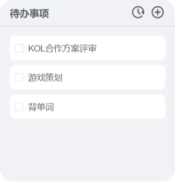
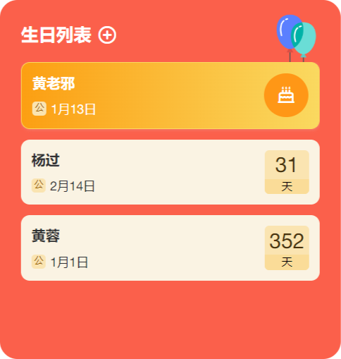
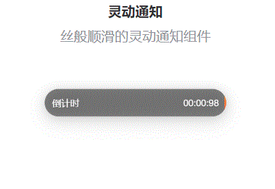
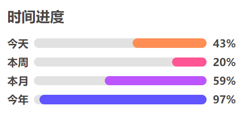
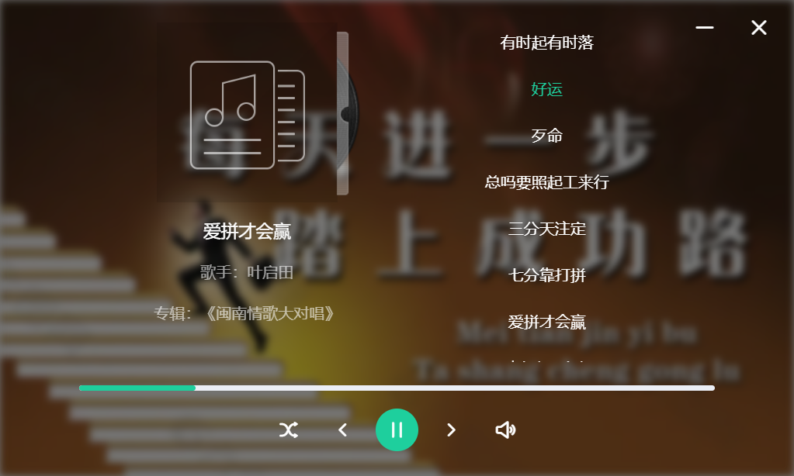

<p align="center">
<a href="https://github.com/widget-js/widgets">
  
</a>
<br>
桌面组件
</p>

<p align="center">
  
  
  <a href="https://space.bilibili.com/207395767"></a>
  <a href="https://txc.qq.com/products/450189"></a>
  <a href="https://discord.gg/vwSAaRR8cT"></a>
</p>


### 说明

这是桌面组件前端开源组件，项目还在持续完善中

### Windows 10/11 客户端下载

1. https://www.microsoft.com/store/productId/9NPR50GQ7T53
2. https://widgetjs.cn

### 项目目录结构

```
widgets
├── src
│   ├── components                // 常用Vue组件
│   ├── views                     //
│   ├── widgets                   // 桌面组件文件
│   │   ├── countdown             // 每个桌面组件一个文件夹
│   │   │   ├── XXWidget.vue      // 桌面小组件
│   │   │   ├── XXConfig.vue      // 小组件配置页面
│   │   │   └── XXView.vue        // 小组件页面
│   │   └── ...
│   └── index.ts
├── .gitignore
├── package.json
├── README.md
└── tsconfig.json
```

### 运行项目

#### 1.下载并运行桌面组件客户端

1. https://www.microsoft.com/store/productId/9NPR50GQ7T53
2. https://widgetjs.cn

#### 2.克隆代码

```shell
#克隆代码
git clone https://github.com/widget-js/widget.git

```

#### 3.到项目目录下载依赖

```shell
pnpm install
```

#### 4.运行

```shell
pnpm serve
```

### 创建自己的组件

```shell
// 安装组件脚手架
npm install -g @widget-js/cli
// 在项目根目录运行 创建组件命令
widget create
```

### 组件列表

#### 键盘演示(src/widgets/keystroke)


#### 抖音热榜（热点组件包：https://github.com/widget-js/hotspot）


#### 剪切板搜索(src/widgets/clipboard)


#### 喝水提醒


- 代码路径：/widgets/water-reminder
- 组件路由：/widget/water_reminder
- 配置路由：/widget/config/water_reminder

#### 待办事项



- 代码路径：/widgets/todo-list
- 组件路由：/widget/todo-list
- 配置路由：/widget/config/todo-list

#### 轮播相册(src/widgets/photo)


#### 生日列表



- 代码路径：/widgets/birthday_list
- 组件路由：/widget/birthday_list
- 配置路由：/widget/config/birthday_list

#### 倒计时


- 代码路径：/widgets/countdown
- 组件路由：/widget/countdown
- 配置路由：/widget/config/countdown

#### 倒计时2


- 代码路径：/widgets/countdown2
- 组件路由：/widget/countdown2
- 配置路由：/widget/config/countdown2

#### 灵动通知



- 代码路径：/widgets/dynamic_island
- 组件路由：/widget/dynamic_island
- 配置路由：/widget/config/dynamic_island

#### 打工进度


- 代码路径：/widgets/labor_progress
- 组件路由：/widget/labor_progress
- 配置路由：/widget/config/labor_progress

#### 时间进度



- 代码路径：/widgets/time_progress
- 组件路由：/widget/time_progress

#### 知乎热榜


见热点组件包：https://github.com/widget-js/hotspot

#### bilibili热榜


见热点组件包：https://github.com/widget-js/hotspot

#### 微博热榜


见热点组件包：https://github.com/widget-js/hotspot

### 时钟组件包

https://github.com/rtugeek/clock

#### 翻页时钟


#### 时钟


#### 故障时钟


#### 歌词小说



- 代码路径：/widgets/lyric_book
- 组件路由：/widget/lyric_book
