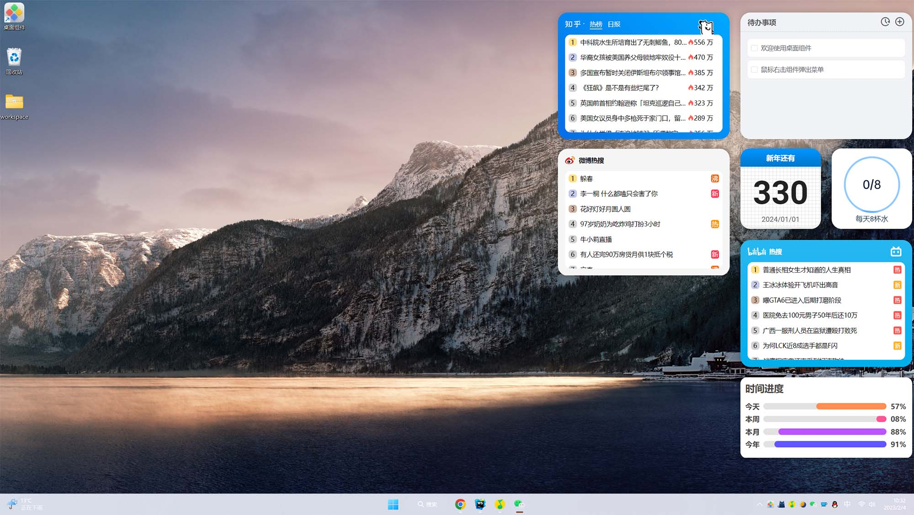
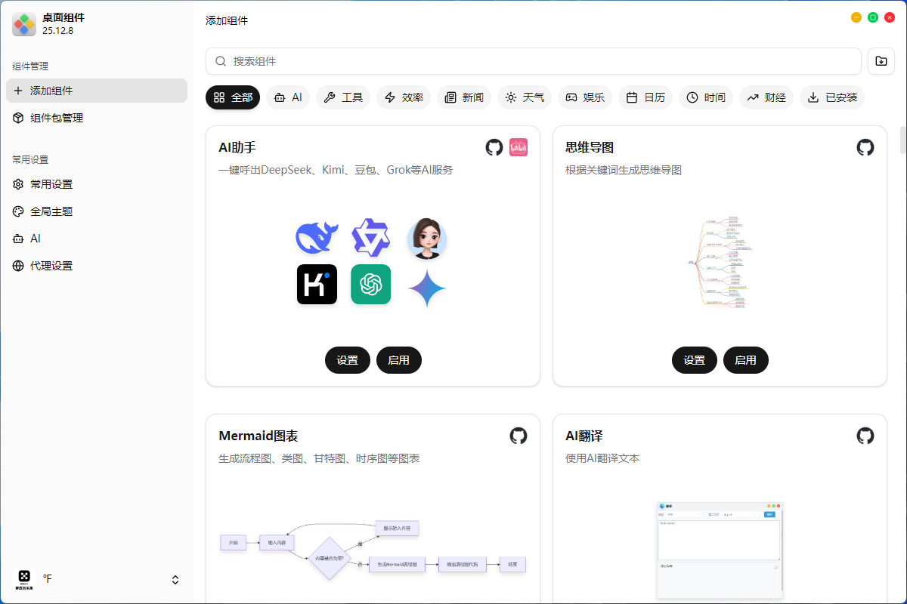
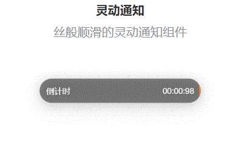
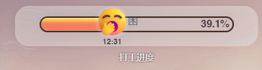
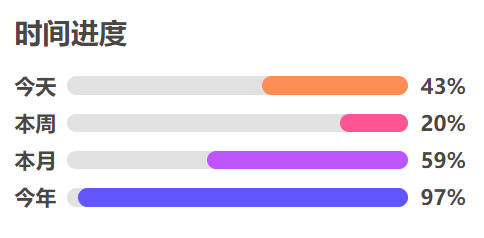

<p align="center">
<a href="https://github.com/widget-js/widgets">
  
</a>
<br>
桌面组件
</p>

<p align="center">
  
  <a href="https://space.bilibili.com/207395767"></a>
  <a href="https://faq.widgetjs.cn"></a>
  <a href="https://discord.gg/vwSAaRR8cT"></a>
</p>




## 🔗预览所有组件

https://widget-js.github.io/widgets/#/




## 📖说明

这是桌面组件前端开源组件，项目还在持续完善中

Windows 10/11 客户端下载地址：
- https://www.microsoft.com/store/productId/9NPR50GQ7T53
- https://widgetjs.cn

## ▶️运行项目

1. 下载并运行桌面组件客户端
2. 克隆代码

```shell
git clone https://github.com/widget-js/widget.git
```

3. 到项目目录下载依赖

```shell
pnpm run install
```

4. 运行

```shell
pnpm run dev
```
## 📋组件列表

### AI组件包

https://github.com/rtugeek/ai

### 一键呼出AI DeepSeek/ChatGPT/Gemini


### 监控组件包

|                                                       监控组件包                                                        |
|:------------------------------------------------------------------------------------------------------------------:|
|    <br/>监控面板   |
|  <br/>打工能耗标签 |
|    <br/>服务器监控面板    |

### 默认组件包

| 默认组件包 |                                   https://github.com/widget-js/widgets                                   |
|:-----:|:--------------------------------------------------------------------------------------------------------:|
|  倒计时  |                                                                   |
| 灵动通知  |                                                                     |
| 打工进度  |                                           |
| 时间进度  |  |

### 文件夹

https://github.com/rtugeek/grid


### iTime组件包

| iTime组件包 |                                        https://github.com/rtugeek/itime-web                                         |
|:--------:|:-------------------------------------------------------------------------------------------------------------------:|
|   待办事项   |  |
| Deadline |     |
|   番茄钟    |     |
|    日历    |     |

### 剪切板组件包

| 剪切板组件包 |                                     https://github.com/rtugeek/clipboard                                     |
|:------:|:------------------------------------------------------------------------------------------------------------:|
|  剪切板   |  |

### 天气组件包

| 天气组件包 |                             https://github.com/rtugeek/weather                             |
|:-----:|:------------------------------------------------------------------------------------------:|
|  2x2  |   |
|  4x2  |  |
|  4x4  |   |

### 热点组件包

|                                                       热点组件包                                                        | https://github.com/widget-js/hotspot                                                                        |
|:------------------------------------------------------------------------------------------------------------------:|-------------------------------------------------------------------------------------------------------------|
|       |  |
|              |     |
|   <br/>追番助手 |                                                                                                             |

### 时钟组件包

|                                                           时钟组件包                                                           |                                            https://github.com/rtugeek/clock                                             |
|:-------------------------------------------------------------------------------------------------------------------------:|:-----------------------------------------------------------------------------------------------------------------------:|
|    <br/>翻页时钟    |          <br/>时钟        |
|   <br/>故障时钟 |   <br/>米奇时钟 |

### 相册组件包

|                                                   相册组件包                                                   |                                      https://github.com/rtugeek/photo                                       |
|:---------------------------------------------------------------------------------------------------------:|:-----------------------------------------------------------------------------------------------------------:|
|  <br/>大头贴 |   <br/>轮播相册 |

### 趣味组件包

|                                                     趣味组件包                                                     |                                                  https://github.com/rtugeek/fun                                                  |
|:-------------------------------------------------------------------------------------------------------------:|:--------------------------------------------------------------------------------------------------------------------------------:|
|  <br/>电子木鱼 |  <br/>仪表盘 |


