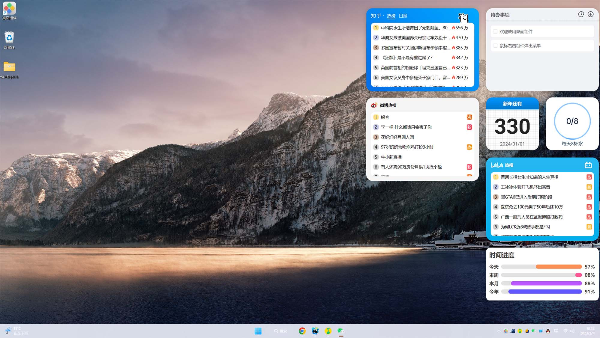
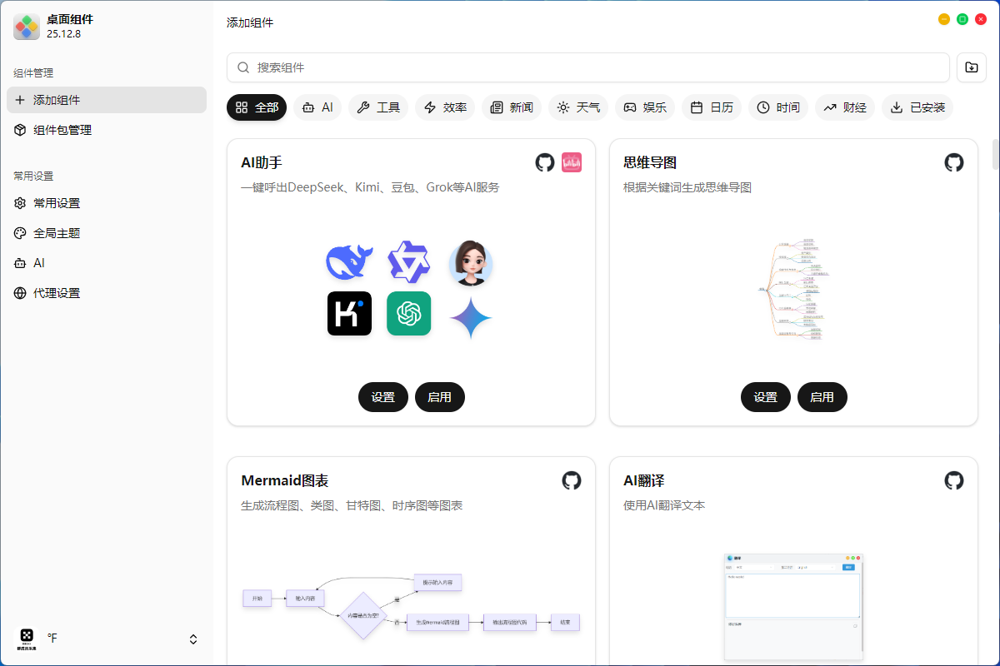

<p align="right">
  中文 | <a href="./README.md">English</a>
</p>

<p align="center">
<a href="https://github.com/widget-js/widgets">
  
</a>
<br>
桌面组件 - Widget Hub
</p>

<p align="center">
  
  <a href="https://space.bilibili.com/207395767"></a>
  <a href="https://discord.gg/vwSAaRR8cT"></a>
</p>




## 🔗预览所有组件

https://widget-js.github.io/widgets/#/




## 🤖使用AI生成桌面组件

#### 1. 安装软件
- AI编程工具（Claude Code、Trae、Codex等，任选一个）
- Node.js

#### 2. 安装Skill
```shell
npx skills@latest add widget-js/skills
```

#### 3. 在AI编程工具里，配置下MCP Server
```json
{
  "mcpServers": {
    "widgetjs": {
      "transport": "streamableHttp",
      "url": "http://127.0.0.1:3606/mcp"
    }
  }
}
```

#### 4. 调用skill，并填写提示词
```
/widget 帮我生成一个股票组件，宽高4*4，用户可以自选股票代码，组件可以显示股票的实时价格和涨跌幅
```


[📃完整文档链接](https://widgetjs.cn/guide)
